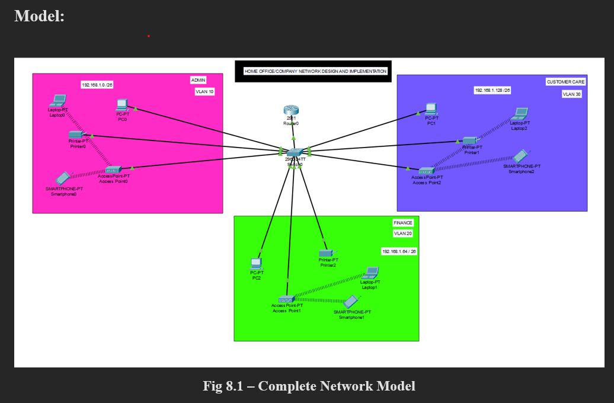
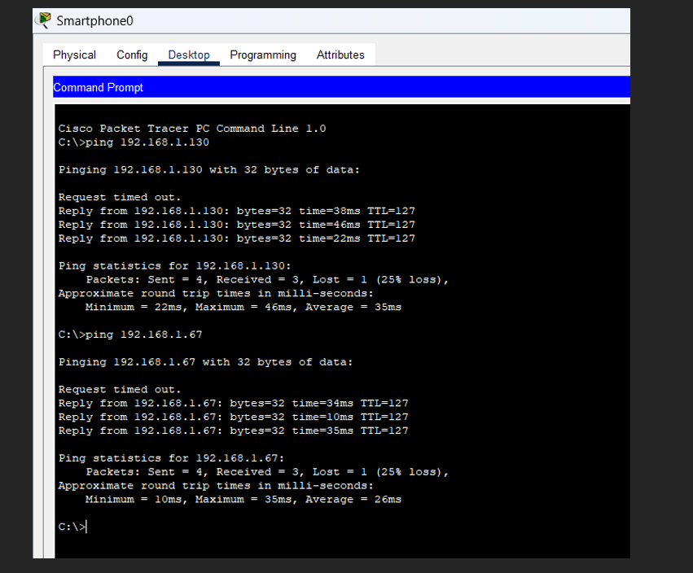

# 🌐 Design and Implementation of LAN Network for a Small Office

## 📖 Project Overview
This project demonstrates the **design and implementation of a LAN network for a small home office** environment using **Cisco Packet Tracer 8.2.1**.  
The aim was to create a structured, scalable, and efficient network that supports multiple departments, wireless access, VLAN configuration, DHCP, and inter-department communication.

The project was completed as part of my **Summer Internship-I.

---

## 🔧 Tools & Technologies
- Cisco Packet Tracer 8.2.1  
- Routers, Switches, PCs, Printers, Wireless Access Points  
- Networking concepts: VLANs, Subnetting, DHCP, Routing  
---

## 🏛️ Project Requirements
- One **2911 Router**  
- One **2960-24TT Switch**  
- Three departments: **Admin, Finance, Customer Care**  
- VLAN setup for each department  
- Wireless connectivity for laptops and smartphones  
- Automatic IP allocation using **DHCP**  
- Devices across all departments should communicate with each other  

---

## 📂 Project Files
- `home office network.pkt` → Cisco Packet Tracer topology file  
- `Networking internship report.pdf` → Detailed internship report  
- `model.png` → Network design model screenshot  
- `result.png` → Simulation result (successful connectivity)

---

## 📸 Screenshots

### Network Model


### Simulation Result


---

## 🚀 How to Use
1. Clone or download this repository:
   ```bash
   git clone https://github.com/hbSrujana/Design-and-Implementation-of-LAN-Network-for-a-small-office.git
